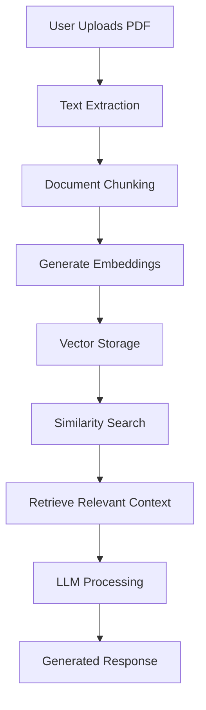

# AURA AI Assistant

## AI-Powered Document Intelligence System using Retrieval Augmented Generation (RAG)

AURA AI Assistant is an intelligent document-based AI system that allows users to upload PDF documents and interact with them through natural language queries.

The system uses **Retrieval Augmented Generation (RAG)** to retrieve relevant information from uploaded documents and generate accurate, context-aware responses using Large Language Models (LLMs).

This project demonstrates a complete Generative AI pipeline including document processing, text extraction, embeddings generation, semantic search, and LLM-based response generation.

---

## Key Features

### 📄 Document Understanding

* Upload PDF documents and extract meaningful information.
* Processes documents into AI-searchable knowledge.

### 🔎 Retrieval Augmented Generation (RAG)

* Converts document content into vector embeddings.
* Performs semantic similarity search to retrieve relevant information.
* Generates responses grounded in uploaded document context.

### 🤖 AI-Powered Question Answering

* Ask questions directly from uploaded documents.
* Provides context-aware and meaningful answers.

### ⚡ Fast Backend API

* Built using FastAPI.
* Modular backend architecture for scalability and maintainability.

---

# System Architecture



---

# Tech Stack

## Backend

* Python
* FastAPI

## Generative AI

* Large Language Models (LLM)
* Retrieval Augmented Generation (RAG)
* Text Embeddings
* Semantic Search

## AI Tools & Frameworks

* LangChain
* Google Gemini API

## Frontend

* HTML
* CSS
* JavaScript

## Development Tools

* Git & GitHub
* VS Code

---

# Project Structure

```
AURA-AI-WORKSPACE/

│
├── app/
│   ├── routers/
│   ├── services/
│   ├── schemas/
│   └── main.py
│
├── static/
│   └── index.html
│
├── requirements.txt
├── .env.example
├── README.md
└── .gitignore
```

---

# Installation & Setup

### 1. Clone Repository

```bash
git clone https://github.com/sufiyatabassum308-stack/aura-ai-workspace.git
```

### 2. Navigate to Project Directory

```bash
cd aura-ai-workspace
```

### 3. Create Virtual Environment

```bash
python -m venv venv
```

Activate:

Windows:

```bash
venv\Scripts\activate
```

Linux/Mac:

```bash
source venv/bin/activate
```

### 4. Install Dependencies

```bash
pip install -r requirements.txt
```

### 5. Configure Environment Variables

Create a `.env` file:

```
GEMINI_API_KEY=your_api_key_here
DATABASE_URL=your_database_url
SECRET_KEY=your_secret_key
```

### 6. Run Application

```bash
uvicorn app.main:app --reload
```

Application runs at:

```
http://127.0.0.1:8000
```

---

# How It Works

1. User uploads a PDF document.
2. The system extracts text from the document.
3. Extracted text is split into meaningful chunks.
4. Chunks are converted into vector embeddings.
5. Embeddings are stored for efficient retrieval.
6. User queries are matched with relevant document sections.
7. The LLM generates answers using retrieved context.

---

# Learning Outcomes

Through this project, I implemented:

* Real-world Generative AI application development
* RAG pipeline design and implementation
* LLM API integration
* Document processing workflows
* Semantic search systems
* FastAPI backend development
* AI application deployment workflow

---

# Future Improvements

* Support for multiple document formats
* Conversation memory
* User authentication
* Advanced document analytics
* Cloud-based vector database integration

---

# Author

**Sufiya Tabassum**

Data Science Engineering Student focused on:

* Artificial Intelligence
* Generative AI
* Backend Development
* Machine Learning Applications

